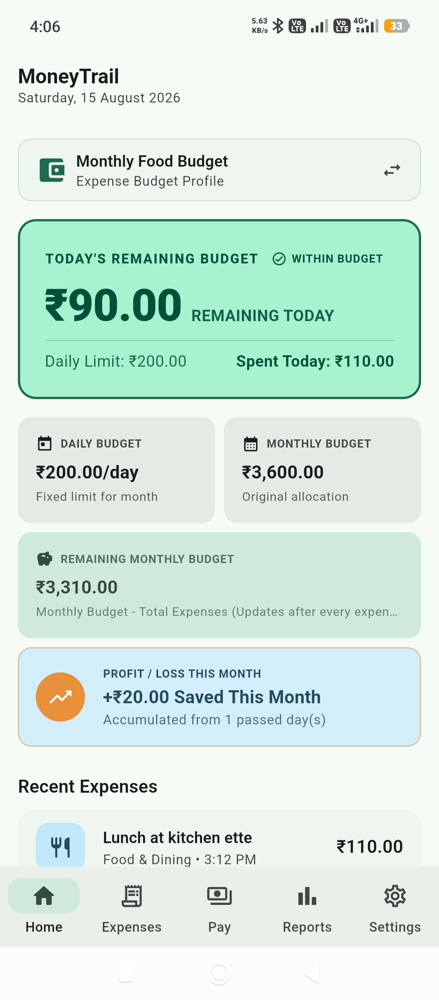
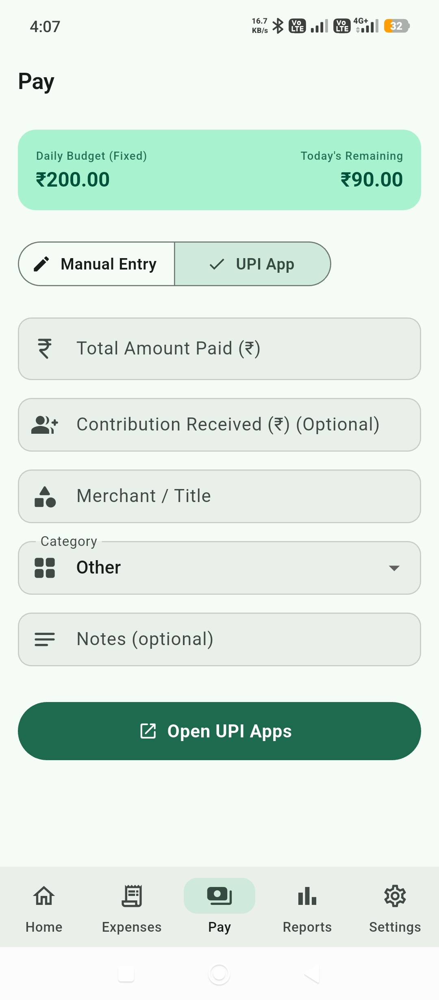

# MoneyTrail

A modern personal expense management application designed to help users track spending, manage budgets, monitor financial habits, and gain complete visibility into where their money goes.

---

## Overview

MoneyTrail was built to make personal finance simple, transparent, and organized.

Instead of being just another expense tracker, MoneyTrail combines expense recording, budget monitoring, payment tracking, and financial insights into a single easy-to-use application.

Whether you're tracking daily spending, managing a monthly budget, or reviewing your financial habits, MoneyTrail helps you stay in control.

---

## Features

### Expense Tracking

- Record and manage daily expenses
- View complete transaction history
- Organize spending across profiles
- Maintain accurate spending timelines

### Budget Management

- Create budget-based profiles
- Monitor spending against available budgets
- Track remaining balances
- View financial status at a glance

### Smart Payment Tracking

- Launch installed UPI applications directly
- Support popular UPI applications
- Track expenses linked to payment activity
- Record expenses after payment confirmation
- Preserve payment information when switching between applications

### Financial Dashboard

- Budget overview
- Total spending insights
- Remaining balance visibility
- Recovery and contribution tracking
- Financial summaries

### Payment Recovery System

- Recover pending payments after returning from a UPI application
- Preserve transaction information across app switches
- Prevent accidental data loss
- Maintain accurate payment and expense timelines

### Local-First Architecture

- Fast performance
- Offline functionality
- Data stored locally on the device
- No account required

---

## How It Works

MoneyTrail integrates with installed UPI applications while keeping expense tracking simple and accurate.

```text
MoneyTrail
    ↓
Pay Now
    ↓
Choose UPI App
    ↓
Complete Payment
    ↓
Return to MoneyTrail
    ↓
Confirm Payment
    ↓
Expense Logged
```

When a payment is confirmed, MoneyTrail records the expense while preserving the original payment initiation time, ensuring accurate financial timelines and reporting.

---

## Screenshots

<table>
<tr>
<td align="center">
<b>Dashboard</b><br>

</td>

<tr>
<td align="center">
<b>Profile</b><br>

</td>

<tr>
<td align="center">
<b>Payment</b><br>

</td>
</table>

---

## Technology Stack

### Framework

- Flutter

### State Management

- Riverpod

### Local Storage

- Hive

### Platform Support

- Android

### Payment Integration

- UPI Application Integration
- Android Native Platform Channels

---

## Download

The latest Android APK is available in the **Releases** section.

### Installation

1. Download the latest APK from the Releases page.
2. Enable installation from unknown sources if prompted.
3. Install the APK.
4. Launch MoneyTrail.

---

## Why MoneyTrail?

MoneyTrail helps users understand where their money goes by combining expense tracking, budgeting, and payment workflows into one streamlined experience.

The goal is to provide:

- Better spending awareness
- Improved budget control
- Clear financial visibility
- Simple and efficient expense management
- A reliable record of daily financial activity

---

## Privacy

MoneyTrail follows a local-first approach.

- Financial data remains on the user's device.
- No mandatory account creation.
- No cloud dependency for core functionality.
- User data is not shared with third parties by default.

---

## Current Version

**v1.0.0**

### Highlights

- Expense tracking
- Budget management
- UPI payment workflow
- Financial dashboard
- Payment recovery system
- Local storage
- Accurate expense timestamp tracking

---

## Roadmap

Planned future improvements:

- iOS support
- Data export (CSV/Excel)
- Cloud backup and synchronization
- Advanced analytics and reporting
- Enhanced spending insights
- Additional customization options
- Performance improvements

---

## License

This project is distributed under the MoneyTrail Proprietary License.

See the [LICENSE](LICENSE) file for details.

---

## Feedback

Feedback, bug reports, and feature suggestions are welcome through GitHub Issues.

If you encounter a problem or have an idea that could improve MoneyTrail, feel free to open an issue.

---

## Support

If you find MoneyTrail useful, consider starring the repository and sharing it with others.

---

**MoneyTrail — Follow your spending. Master your finances.**